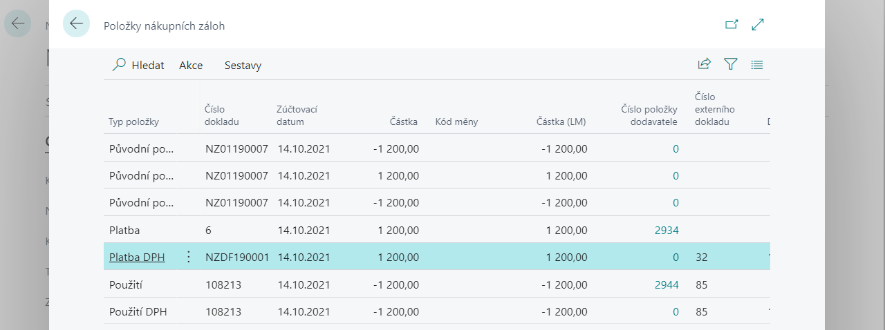
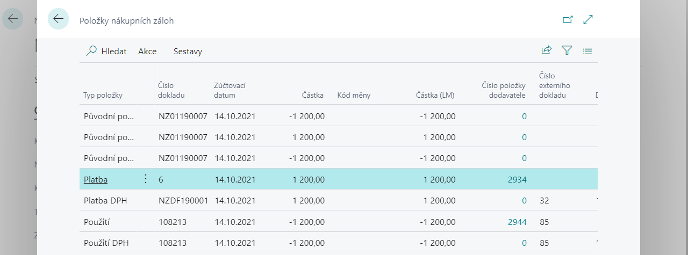

# Additional functions (corrections)

In addition to basic functionality such as creating, paying and using a deposit, the Advance Payments application also provides some additional functions to facilitate work with advance documents. These additional features include:

- Cancellation of advance tax document
- Disconnecting an incorrect payment from a deposit
- Disconnecting payment from the deposit
- Disconnection of payment from advance payments out of items
- Additional payment connection to the deposit

## Cancellation of advance tax document

You can use the function for cancelling an advance tax document, e.g. if you incorrectly post an advance tax document to pay a purchase advance and need to unposed the document.

To cancel an advance tax receipt, proceed as follows:

1. Select an icon, enter **Advance purchase invoice** and then select related link.
2. In the list, search for a purchase advance invoice that is paid and has a tax document posted to it. Then use function **Prepaid entries.**
3. This will open a list of purchase invoice items, where you can place the cursor on the line with  **Entry type - VAT payment**
 
4. In the action bar select **Account for tax credit**.
5. All data from the entry is pre-filled into the current page **VAT payment**. Check the data and confirm with the button **OK**.
6. A new entry is created in the advance entries with **Type of entry VAT payment** with opposite sign. The entry is also reflected in the accounts (items of property) and in the VAT entry.

If you now want to re-post the tax document for the deposit, place the cursor on the line with **Type of entry Payment** and select action **Post a tax document**.

## Disconnecting an incorrect payment from a deposit

If you have attached an incorrect payment to an advance, it is possible to disconnect it. The function is available from the advance entries under the function **Disconnect advance payment**. Disconnection is only possible if the advance payment has not yet been drawn on any final document.

### Disconnecting payment from the deposit

To disconnect payment from deposit, proceed as follows:

1. Select icon , enter **Advance purchase invoice** and then select related link.
2. In the list, find the purchase advance invoice that is paid.
3. Select action **Advance entries**.
4. Place cursor on the line with **Entry type - Payment**.  
 
5. Select action **Disconnect payment from the deposit**.
6. A new entry is created in the advance entries with **Entry type - Payment** with opposite sign. If there was a tax document for the payment (line with **Entry type - VAT payment**), an advance document with the opposite sign is automatically created, and therefore the opposite item **VAT payment.**
7. The entry is also reflected in the accounts (posting purchases) and in the VAT entry. New supplier or customer entries are created to transfer an entry from the advance account to the standard balance account.

### Disconnection of payment from advance payments out of items

To disconnect the payment from the advance from the supplier's items, resp. customer proceed as follows:

It is also possible to disconnect the incorrect payment from the advance from the supplier's items, resp. customer. From customer entry, which has **Type of document Payment** and filled field **Number of advance**, it is possible to use **Disconnect payment from advance payments** to disconnect payment from advance.

1. Find vendor entry, resp. customer, which advance invoice was paid.
2. Select action **Disconnect advance payment**.
3. A new entry is created in the advance entries with **Entry type - Payment** with opposite sign.  If there was a tax document for the payment (line with **Entry type - VAT payment**), an advance document with the opposite sign is automatically created, and therefore the opposite item **VAT payment**.
4. The entry is also reflected in the accounts (posting purchases) and in the VAT entry. New vendor or customer entries are created to transfer an entry from the advance account to the standard balance account.

## Additional payment connection to the deposit

If the vendor balance, resp. customer post payment, that was not attached to the deposit at the time of posting, it can be attached to the deposit afterwards. Function is available from vendor entry, resp. customer.

Additional payment attachment to the deposit:

1. Find opened vendor entry, resp. customer, which has **Entry type = Payment**.
2. Select action **Link the advance invoice**
3. On the opened page select *New*.
4. From field **Advance number** use the help button to view an overview of available advances
5. Place cursor on the line with advance that you want to link and confirm with the button **OK**
6. Also confirm the advance link page with the button **OK**.
7. Payment is linked to the deposit. An advance entry has been created **Entry type - Payment**, or **VAT payment**. The entry is also reflected in the accounts (posting purchases), or VAT entry.New vendor or customer entries are created to transfer an entry from the advance account to the standard balance account.

## Disconnecting a deposit from a posted invoice

If the invoice and the advance payment are incorrectly linked, it is possible to additionally disconnect these documents from each other.

Function has some limitations:

- If multiple advances are attached to a posted invoice, it is always necessary to disconnect all advances at the same time, i.e. it is not possible to leave one advance attached and disconnect the others.
- The disconnection is always made with the same billing date and VAT date as the original document.
- If the accounting period is already closed or restricted for the user, cancellation is not possible.

To disconnect a deposit from a posted invoice, proceed as follows:

1. Find posted invoice to which the advance is attached.
2. Select the action above invoice **Cancel the use of advance invoice**.
3. Confirm dialog box.
4. The advance is removed from the invoice. Opposite entries are created in the advance entries, which have **Document type = Use**, or VAT use. The entry is also reflected in the accounts (posting purchases), or VAT entry.New vendor or customer entries are created to transfer an entry from the advance account to the standard balance account.

## Adding a deposit to a posted invoice

If a deposit was omitted when posting a sales or purchase invoice, it is possible to add the deposit to the document afterwards. The function is available from a posted sales invoice using the action **Use advance invoice**.

Function has some limitations:

- The original settlement date and the VAT date as in the original invoice are used to account for the settlement of the invoice and the advance.
- It is not possible to start posting preview before posting.
- The amount of the advance payment must have a maximum value of the balance of the booked invoice or customer item with the Invoice type, if, for example, the invoice has been partially paid in another way. When linking a deposit and an invoice afterwards, the system does not automatically reduce the amount of the drawn deposit, it must be adjusted by the user.

To add a deposit to a posted invoice, do the following:

1. Find posted invoice to which the advance is not attached.
2. Select the function **Use of advance invoice**.
3. On the opened page select **New**.
4. From field **Advance number** use the help button to view an overview of available advances.
5. Place cursor on the line with advance that you want to link and confirm with the button **OK**.
6. If you want to link another advance to invoice, do the following.
7. Edit the value in the field **Amount** to correspond to the maximum invoice balance.
8. Page with linked invoice confirm with the button **OK**.
9. The deposit is linked to the invoice. Items have been created in the advance items that have **Type document = Use**,or **VAT use**. The entries are also reflected in the accounts (posting purchases), or VAT entry. New vendor or customer entries are created to transfer an entry from the advance account to the standard balance account.  New vendor or customer entries are created to transfer an entry from the advance account to the standard balance account.

## See also

[Advanced payments localization(extensions)](ui-extensions-advance-payments-localization-cz.md)  
[Czech local functionality](czech-local-functionality.md)  
[Finance](../../finance.md)
