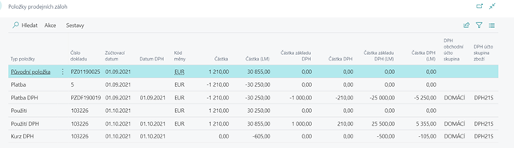
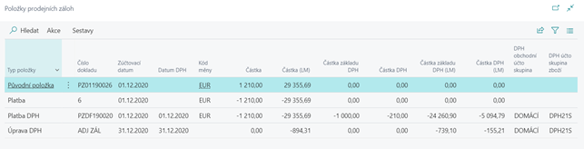

# Foreign currency advances

The Advance Payments application works with foreign currencies. However, it is necessary to follow the rule of maintaining a single currency throughout the entire life cycle of the advance, i.e. advance, payment, invoice, closing - everything must be accounted for in one currency.

- Advance entries are always recorded in both foreign and local currency.
- If you have set up automatic creation of an advance tax document for a sales advance, the VAT is automatically accounted for at the exchange rate used when the advance was paid. When you manually create a tax document for a purchase advance, the exchange rate for the advance payment is automatically prepared in the dialog box
-If the exchange rate between the payment and the final invoice differs, a new entry with the type VAT rate is created in the advance items to balance the total amount of the advance, the base and the VAT amount in the local currency.

## Advance payment in foreign currency

1. Select icon , enter **Sales advance invoice** and then select related link.
2. Create new sales advance invoice to any of customer.
3. To field **Currency code** on the tab **Details of invoice** select e.g. Euro
4. In the advance field select **Inventory VAT posting group** and **Amount included VAT**.
5. Release the advance using the **Release** action ribbon.
6. Find and open **General journal**.
7. On the general journal line, fill the field **Document type = payment**, enter relevant customer number.
8. In the field **Currency code** select EUR and set up exchange rate
9. In the field **Advance number** select number of advance invoice, created in previous steps.
10. Complete the counter-contact and post the journal.
11. An entry has been made in the advance entries with **Entry type = Payment**.

## Linking a deposit to an invoice

1. Select icon , enter **Sales advance invoice** and then select related link.
2. Create new sales advance invoice in EUR to same customer, enter exchange rate and invoice lines.
3. Find in the ribbon **Link advance invoice** and linked invoice with advance (chapter *Use of the advance invoice in the final invoice*).
4. Post the invoice.
5. If the exchange rate between the payment and the final invoice is different, a new entry with the type **VAT rate** for adjustment of the total amount of the advance payment in CZK and adjustment of the base and VAT amount in CZK.

## Year-end recalculation of advances

At the end of the year, the balance of customers in foreign currency must be converted at the exchange rate announced by the CNB. Standard functions for **Adjustment of exchange rates** recalculates only customer and supplier entries, creating detail entries for them to adjust the originally posted value. This will also recalculate the advance payment items. However, the advance invoices themselves are not affected by this standard feature.

If you want to reflect the results of the exchange rate adjustment also in the advance items (recalculate VAT in local currency on advances), you need to run the subsequent report for adjusting advance items - **(Adjust Advance Letter Exchange Rates)**. This function searches for all customer detail items with item type = Unrealized profit or unrealized loss charged on the selected date (e.g. 31.12.) and converts them into advance items with type Adjustment of VAT. It adjusts the total amount of the advance in local currency and the amounts of the base and VAT in local currency. The posting is made between the account for **advance payment basis (VAT accounting settings)** and the standard account for exchange differences.

The adjustment of advances will also be made retrospectively, i.e. where an advance is issued and paid in 2020 and is drawn down by invoice in January 2021. If the adjustment is made after this posting, the adjustment will adjust the advance retrospectively to 31.12.20 and subsequently debit the adjustment to the invoice date.

It is not necessary to use the function to recalculate the end-of-year advances. If it is not used, the VAT (in local currency) that was charged when the advance was paid will be used to post the final invoice.
If there are **VAT Adjustment** entries, these will then also be used when posting the end invoices attached to the advance.

## See also

[Advance payments for the Czech Republic (extension)](ui-extensions-advance-payments-localization-cz.md)  
[Czech local functionality](czech-local-functionality.md)  
[Finance](../../finance.md)
