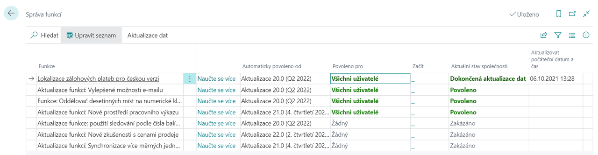

# Activation of Advance Payment functionality and upgrade of existing data  

Activation of the Advance Payments functionality for Czech Republic is initiated via **Manage Features**. Activation is done in 2 steps - user permission and data update. The data update will upgrade the existing backup items and related agendas to the new tables. 

> [!NOTE]
> The data update process is **irreversible**. Once the update is complete, the previous version of the backups will no longer be available and you will not be able to revert to the original version of the backups.

Depending on whether or not the data is converted, either objects in the database will be available in the "obsolete" version - e.g. Sales Prepayments (obsolete), or in the "new" version - e.g. Sales Advances.

Use the following procedure to activate the Advance Payments for Czech Republic functionality:

1. Choose the , enter **Manage Feature** and then select the related link.
2. On the **Manage Feature** card.
3. Select the row for the function **Localization of advance payments for the Czech version** and in the field **Enabled for** select All users.
4. You will then go through the activation guide and data update settings.
5. Once the data has been upgraded from the previous backup version, the value of the **Current Company Status** field will be set to Data Upgrade Complete. From this point on, you can use the new version of the Advance Payments functionality. 

## See Also

[Advance payments for the Czech Republic (extension)](ui-extensions-advance-payments-localization-cz.md)  
[Czech Local Functionality](czech-local-functionality.md)  
[Finance](../../finance.md)
