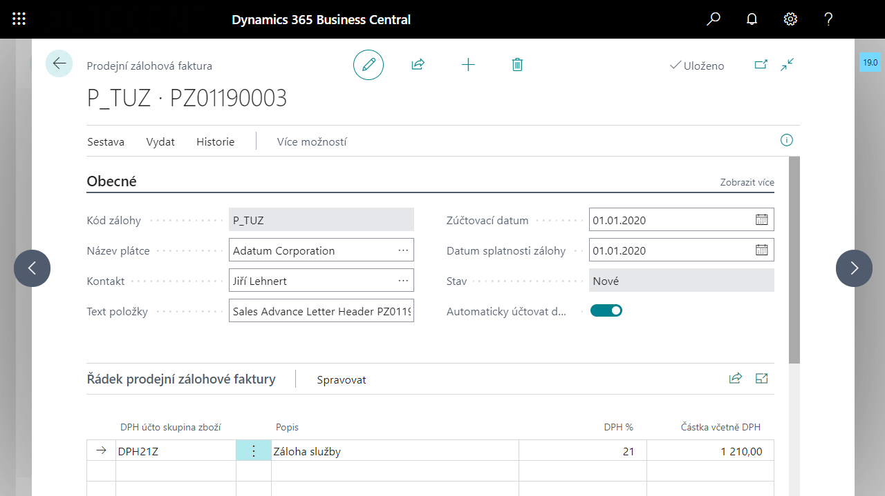

# Understanding the basic principles of Advance Payments and the advance payment lifecycle

## Basic principles of the Advance Payment application

 - Pairing documents at the document header level - the invoice header is paired to the advance header.
 - The **Advance Account** from the **Advance Template** is used to post the advance payment.
 - All advance entries are available in **Advance History** on one page.
 - Most of the actions that can be performed within the advance are triggered from the corresponding entries in the **Advance History**, e.g. from the entry of the **Payment** type it is possible to trigger the function **Post advance VAT document**, or **Disconnect advance payment**, from the entry of the **VAT payment** type it is possible to trigger the function **Post VAT credit note** (for cancellation posting) and print **Advance VAT document**.
 - When posting advance VAT documents or credit notes, no separate header documents are created, only advance entries are created from which VAT documents can be printed.
 - In the General journal (cash receipt), you only need to set the **Document type** with the value Payment and link the entry to the advance via the **Advance number** field.
 - New fields **Advance number** and **Advance template code** are available in the customer/vendor entry, **Advance number** in the VAT entry.
 - In the VAT entry, the advances are posted with the VAT calculation type = **normal VAT** and the standard field **Basis** is used for posting the basis of the advance.
 
## Lifecycle of a sales advance

The entire advance lifecycle is available in one place, the sales or purchase advance invoice tab. All historical entries associated with the advance are recorded here and functions are available for creating VAT documents or credit notes, closing the advance, print reports and more.

The current stage of setting up, paying or drawing an advance is reflected in the **Status** field.

1.	When the advance is created, the advance has the status **New**.
2.	Issuing a deposit changes its status to **Amount to pay**, the initial initialization entry **Initial entry** is created, and the advance is ready to be paid.
3.	By paying the advance through the Cash desk or General journal, its status changes to **For Use**, the advance is ready to be attached and used in the final document. In the entries of the advance, the entry **Payment** or **VAT payment** is created.
4.	Using an advance in an invoice changes the status of the advance to **Closed** if used in full. In the advance entries, an entry with the type **Closure** or **VAT Closure** is created.
5.	If the advance is not used or not used in full, it can be closed using the function. Closing an advance changes the status of the deposit to **Closed**. Entries with the type **Close** or **VAT Close** and a negative Initial entry are created.

## See Also

[Extensions Advance Payments Localization](ui-extensions-advance-payments-localization-cz.md)  
[Czech Local Functionality](czech-local-functionality.md)  
[Finance](../../finance.md)
