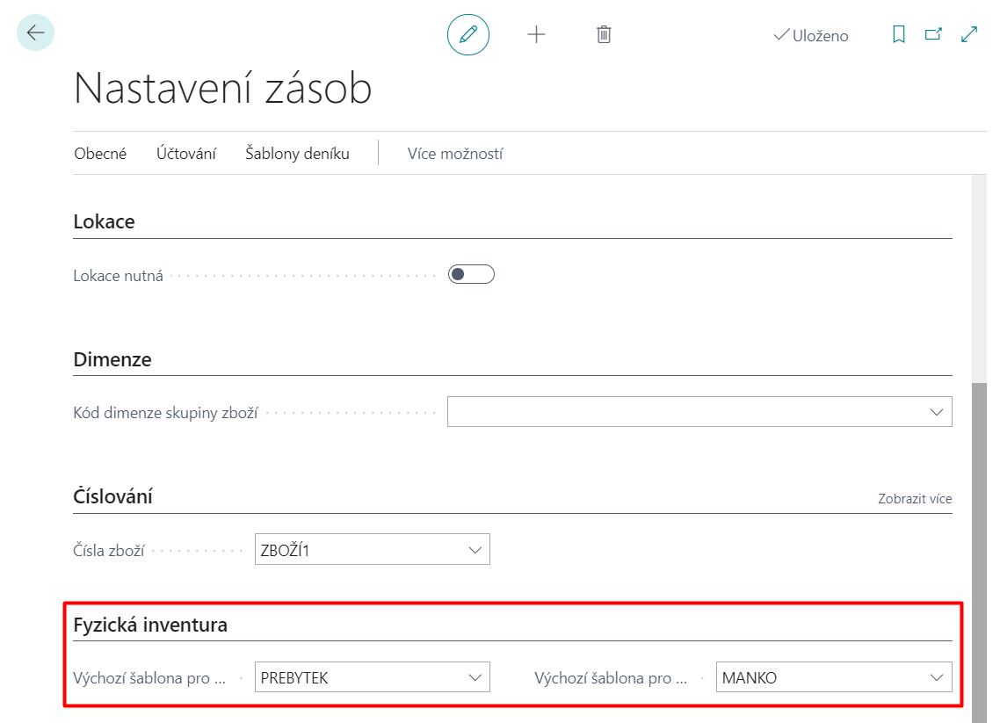

# Advanced features of physical inventory  

To comply with accounting standards, companies are required to separate the accounting for shortages and surpluses in the physical inventory.
Companies need to separate the accounting for inventory movements of the same goods (e.g. have different accounting for shortages within the limit and different accounting for shortages above the limit).

## Physical inventory settings (templates)

By setting default stock movement templates for these stock movements in Inventory Setup, the user can easily change the General Business Account Group depending on the type of stock movement.

1. Use function ") enter **Inventory settings**.
2. On the page **Inventory settings** on the Physical Inventory tab, fill in the field **Default template for receiving physical inventory** and **Default template for issuing physical inventory**.
3. Than you can close the page.

## Use

### Template in the physical inventory journal

The template is automatically filled in the physical inventory log:

1. Use function ") enter **Physical inventory journal**.
2. On the page **Physical inventory journal** click on Actions -> Features -> **Calculate the amount of inventory...**
3. Fill in the parameters as required (with the goods you have in stock) and click OK.
4. If you change the amount in the **Quantity (physical inventory)** field (increase or decrease, depending on the actual state), changes the value in the **Inventory Movement Template** field on that line depending on whether it is a Deficit or Surplus.

Note: Auto-fill field **Inventory movement template** is added for creating physical inventory orders.

### "Insert new blank line" function

 On the **Physical Inventory Log** page, there is a function **Insert New Blank Line**.

If you created a new row in the journal and ran this function (Action -> Function -> Create new blank row), a new blank line is created in the journal from the current line on which the cursor is placed at execution. The new row will have the same values as the copied row, but in the Quantity (calculated) and Quantity (physical inventory) fields, the new row will have a zero value.

## See also

[Core localization pack extensions](ui-extensions-core-localization-pack-cz.md)  
[Czech local functionality](czech-local-functionality.md)  
