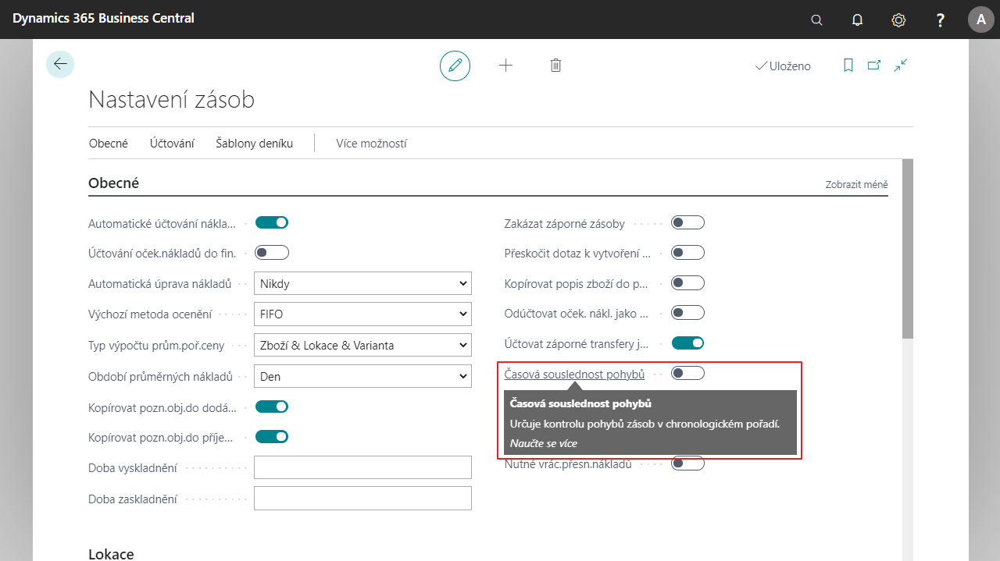

# Inventory control - time sequence

Standard Feature [!INCLUDE[d365fin](../../includes/d365fin_md.md)] was updated with a check of the time continuity of warehouse operations. Once the control is activated, it is ensured that items with a billing date prior to the billing date of receipt cannot be dispensed.

## Activation of the dispensing control in inventory

1. Select icon , enter **Inventory settings** and than choose related link.
2. On the page **Inventory settings** in the tab **General** select field **Time sequence of movements** and turn on.
3. After setting, you can close the tab.

## See also

[Core localization pack extensions](ui-extensions-core-localization-pack-cz.md)  
[Czech local functionality](czech-local-functionality.md)  
