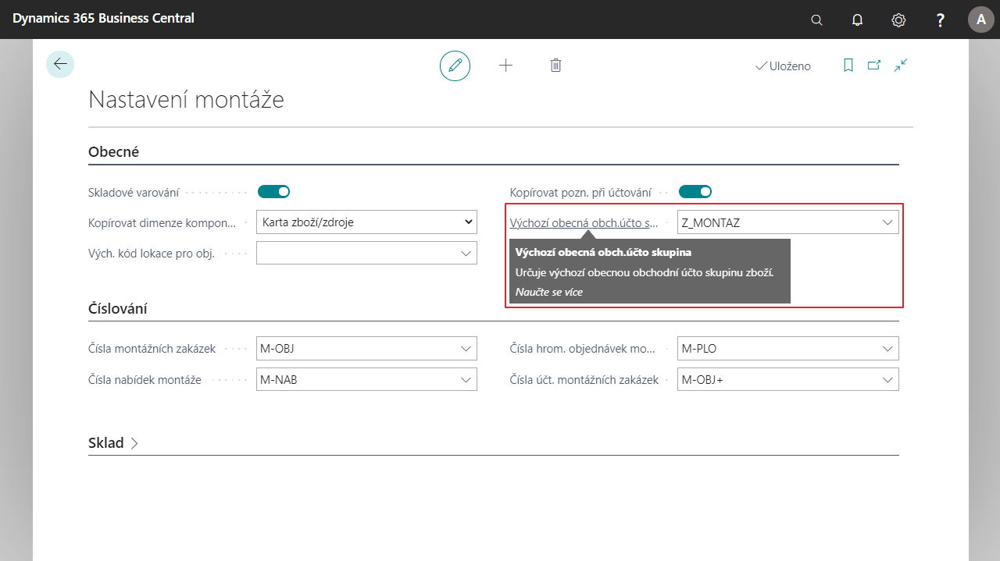

# Default Posting Group for Assembly Orders

Makes it easier to work with assembly orders. In the Assembly Setup, you can define a Default Gen. Product Posting Group, whose value is then added to all newly created assembly orders automatically, there is no need to manually add it to each assembly order. The parameterization of this field affects the posting of the assembly order.

## Setting the Default Inventory Posting Group

1. Choose the , enter **Assembly Setup** and then choose the related link.
2. On the **Assembly Setup** card under **General**, in the **Default General Business Posting Group** field, select the posting group you want to set as the default.
3. After setting up, you can close the card.

## See Also
  
[Core Localization Pack for Czech Republic](ui-extensions-advanced-localization-pack-cz.md)  
[Czech Local Functionality](czech-local-functionality.md)  
