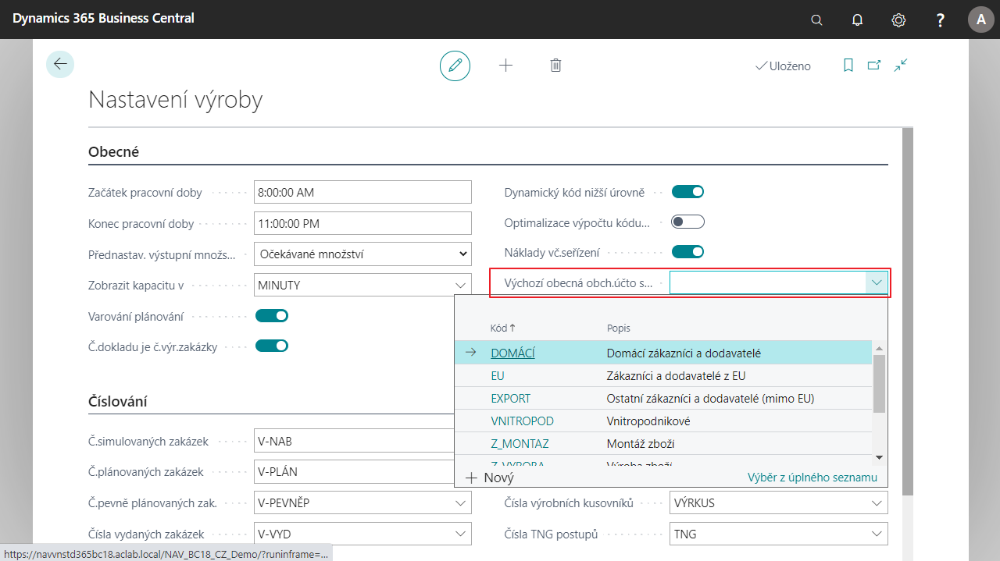

# Default General Posting Group in production

It makes it easier to work with assembly orders. In Setup Manufacturing, a field **Default General Posting Group** is added, whose value is then added to all newly created manufacturing orders (planned, simulated, etc.) automatically, there is no need to enter them manually in each order. The parameterization of this field affects the posting of the manufacturing order.

## Setting up Default Inventory Posting Group

1. Choose the , enter **Setup Manufacturing** and then choose the related link.
2. On the **General** tab, select the appropriate group in the field **Default Business General Posting Group**.
3. When this field is enabled, the posting group is subsequently added to all newly created manufacturing orders.
4. After setting up, you can close Manufacturing Settings.

## See Also

[Core Localization Pack for Czech Republic](ui-extensions-advanced-localization-pack-cz.md)  
[Czech Local Functionality](czech-local-functionality.md)
