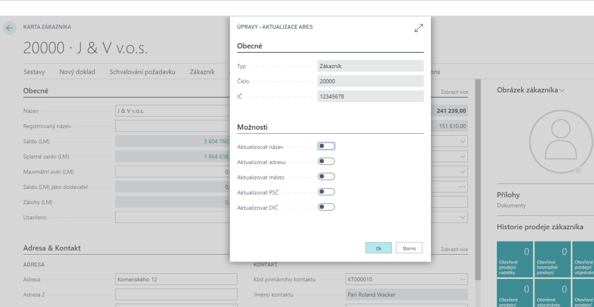

# Updating contacts from ARES

ARES stands for Access to Register of Economic Entities. ARES is an information system enabling the retrieval of information on economic entities registered in the Czech Republic.

## Setting up the Company VAT Registration No. verification service

1. Choose the , enter **Setting up the Company VAT Registration No. Verification Service** and then choose the related link.
2. On the **Verify Company VAT Registration No. Service Settings** card, under **General**, select the **Service Endpoint** field and check or enter "*<http://wwwinfo.mfcr.cz/cgi-bin/ares/darv_bas.cgi>*".
3. To enable the service, select the radio button next to **Enabled**.
4. After setting up, you can close the card.

## Update using ARES
  
You can start the update from ARES from the contact, supplier or customer card. You can search for companies and decide which fields in [!INCLUDE[d365fin](../../includes/d365fin_long_md.md)] to update (name, address, city, postal code, VAT ID).

1. Choose the , enter **Customers** and then choose the related link.
2. Select the chosen customer for which you want to update the data.
3. On the customer tab in the Invoice, click the three dots next to the VAT registration No.
4. The **Verify VAT Registration No.** card will open and use the **Verify VAT Registration No.** function. After successful verification, you will see a line with the status **Valid**.
5. You can now use the **Update Card** function on the **Verify VAT Registration No.** page.
6. The **Update ARES** page opens, where you can select the fields you want to update:
    - Update All
    - Update Name
    - Update Address
    - Update City
    - Update Postal Code
    - Update VAT ID
7. After selecting the fields, click **OK** to complete the update.
8. You can then close the page.

## See Also

[Core Localization Pack for Czech Republic](ui-extensions-core-localization-pack-cz.md)  
[Czech Local Functionality](czech-local-functionality.md)  
[Finance](../../finance.md)  
