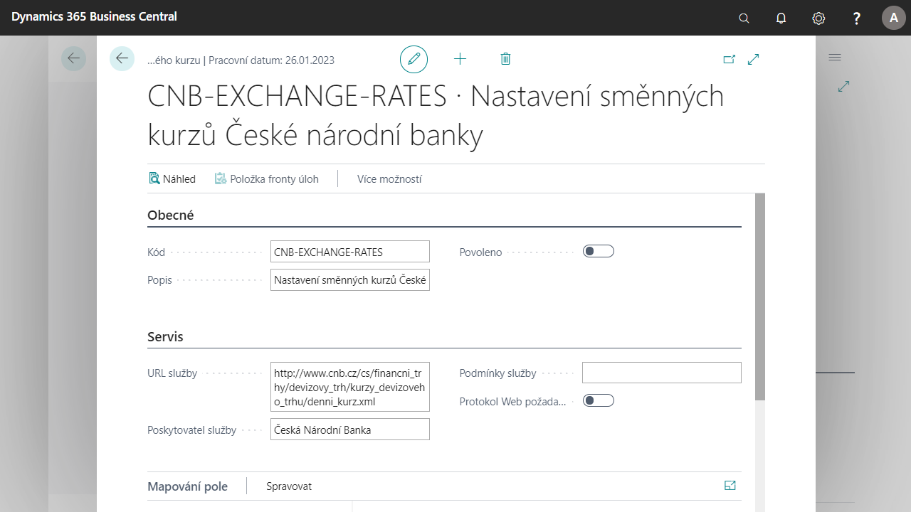

# Exchange rate updates

The Company is able to automatically update currency exchange rates using the functions of the Exchange Rate Service.
These have been improved by the ability to automatically update currency exchange rates according to the CNB (Czech National Bank).
The user can define the http address of the service and other parameters for updating exchange rates in the exchange rate service settings.

## Start and use of exchange rates service according to CNB

1. Select, enter **Exchange rate service** and then choose related link.
2. In the list of Exchange rates service choose **CNB-EXCHANGE-RATES - Exchange rates settings CNB**.
3. On the exchange rates service tab choose **Enabled** for enabling service.
4. After enabling service, system will create background task queue entry: **Procedure∙ 1281 ∙ Update Currency Exchange Rates**, at the same time, the system asks you whether you want to open the task queue item window and whether you want to set the item.
5. In case of confirmation the task queue entry will open which you can set up as you like. You can set up for example period and time, when the exchange rates must be updated.
6. After set up After setting the task queue item, set the status to **Ready**. When the update moment according to the settings occurs, the procedure starts and updates the currency exchange rates.
7. You can close the **Task Queue Items** tab.

## See Also

[Core Localization Pack for Czech Republic](ui-extensions-core-localization-pack-cz.md)  
[Czech Local Functionality](czech-local-functionality.md)  
[Finance](finance.md)  
