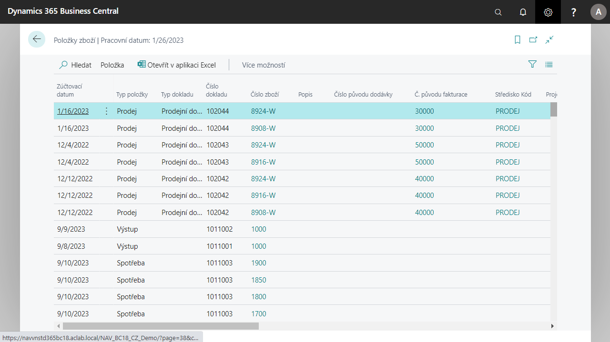

# Origin codes in the item of goods and the item of valuation

The following fields have been added to both records for easier identification of items and appraisal:

- Invoice origin number in which the creditor/payer number is entered
- The origin number of the dispatch to which the recipient's address code is entered
- Currency Code and Currency Factor according to the document from which the item was created.

It is possible to assign a "Cause Code" to each item journal, which is also written into the posted items.

## See also

[Advanced localization pack for Czech republic](ui-extensions-advanced-localization-pack-cz.md)  
[Czech Local Functionality](czech-local-functionality.md)
