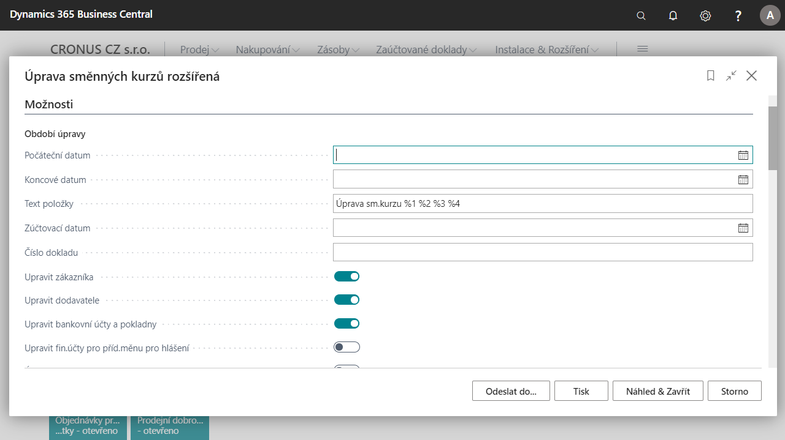

# Exchange rate adjustments (Conversion of receivables, payables, bank accounts and cash)

Most companies in the Czech Republic are asking for the following improvements to be implemented in the area of exchange rate adjustments in the conversion of receivables and payables:

- Ability to manage exchange rate adjustments separately for bank accounts, customers and vendors
- Ability to post exchange rate adjustments in detail or in aggregate by currency
- Ability to run exchange rate adjustments as a simulation (without posting) in test mode

In the standard report Adjusting exchange rates is now possible:

- Set up bank account, customer or vendor as a filter
- Select edit for customers or vendors or bank accounts only
- Select test mode
- Select summary of items
- Select method of dimension transfer

The exchange rate adjustment also includes a changed calculation principle for realized income gains and losses under the Income Tax Act. This function calculates the realized gain or loss against the most recently adjusted amounts.
This function in the standard version of Microsoft [!INCLUDE[d365fin](../../includes/d365fin_long_md.md)] first recognizes the unrealized gain or loss and then calculates the realized gain or loss. The calculation is made against the amount at the original exchange rate when the payment and invoice are processed.
The new calculation principle handles differences from the currently adjusted exchange rate.
The exchange rate adjustment has been extended to include the Czech advance module.

## Use of exchange rate adjustment

1. Choose the , enter **Exchange rate adjustment extended** and then select related link.
2. This will open **Exchange rate adjustment extended** page - preview the report before running it.
3. You can set input parameters such as:
    - Start and End date
    - Item text
    - Settlement date
    - Adjustment possibility:
        - Vendor
        - Customer
        - Bank account and cash desk
        - Financial accounts for additional reporting currency
    - Ability to post
    - Summarize items
    - Ability to transfer dimensions
    - Set up filters:
        - Currency
        - Bank account and cash desk
        - Customer
        - Vendor
4. Then run the report.

## See Also

[Core Localization Pack for Czech Republic](ui-extensions-core-localization-pack-cz.md)  
[Czech Local Functionality](czech-local-functionality.md)  
[Finance](../../finance.md)  
