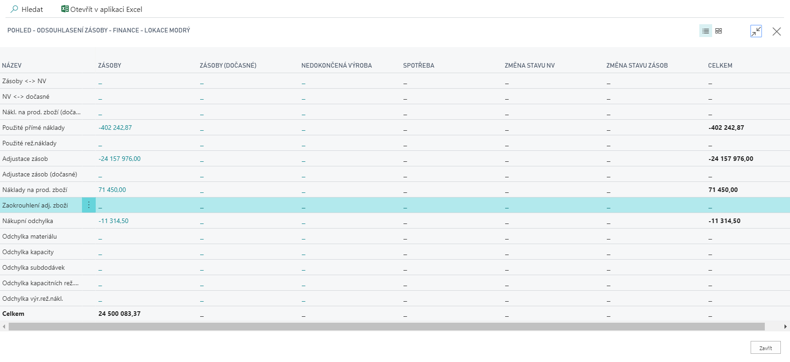

# Reconciliation of inventories against posting

Due to the fact that the Czech localized application contains modifications in inventory posting, the **Inventory Reconciliation - Finance** matrix must be supplemented with special accounts - inventory rounding account and work-in-progress inventory change accounts.  
These modifications were made at user interface together with changes of calculation procedure.

1. Choose the  ") search for  **Inventory reconciliation - finance**.
2. At the page **Inventory reconciliation - finance** specify the necessary filters.
3. Click at the feature **Show matrix**.
4. In the view below, you can see the accounts that have been added.

## See also

[Core localization pack for Czech Republic](ui-extensions-core-localization-pack-cz.md)  
[Czech Local Functionality](czech-local-functionality.md)  
