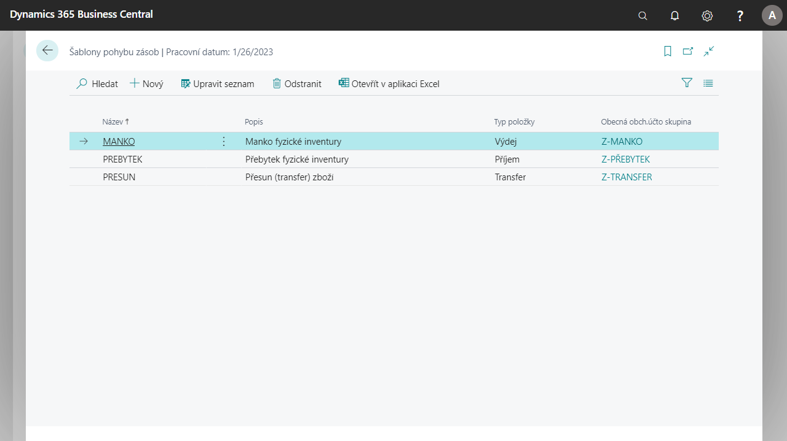

# Inventory movement templates

Movements of items acquired in the inventory journals must be accounted for with the prescribed **Inventory Adjustment Number** that corresponds to the type of movement. A field for selecting the template for the item movement has been added to the inventory log lines.  

## Definition of a custom template for posting inventory movements

Within the template, it is possible to set the type of inventory movement (dispatch, receipt, transfer, etc.) and the general business account group (this determines the financial posting of the inventory movement to the accounting part of the system).
These settings are automatically copied to the inventory log line based on the selected inventory movement template.
Inventory movement templates can be used primarily when posting movements in the inventory journal and project journal. They are also used to post differences in the physical inventory of items.

To create a new template:

1. Choose the  icon, enter **Inventory movement templates** and then select related link.
2. On the Inventory Movement Templates overview, use the **New** function.
3. Enter a name for the movement in the **Name** field, then write a short description of what the movement is for in the description.
4. In the **Item Type** column, select the inventory movement.
5. In the last step, select the appropriate posting group in the **General business posting group** field.
6. Close the overview after filling in the columns.

## Definition and use of a custom template for inventory posting

Example of a inventory movement definition for the CASH DEFICIT type:

1. Choose the  icon, enter **Inventory movement templates** and then select related link.
2. On the Inventory Movement Templates overview, use the **New** function.
3. In the **Name** field, enter a name for the movement, for example **Cash Deficit**. Next, write a short description of what the movement is for in the description.
4. In the **Item Type** column, select the movement, in this example **Output**.
5. In the last step, select the appropriate posting group in the **General ledger posting group** field, for example **Z-CASH DEFICIT** for the example with a shortage.
6. Close the overview after filling in the columns.

## Using Templates in the Item Journal

1. Choose the  icon, enter **Item journal** and then select related link.
2. Create a new journal line.
3. Show new field **Inventory movement template**.
4. In the **Inventory movement template** field, select the template created in the previous step.
5. Check the **Item Type** and **General Ledger Posting Group** fields to make sure they have been completed as set in the previous step.

## Using a template in a physical inventory order line

1. Choose the  icon, enter **Physical inventory orders** and then select related link.
2. On the Physical Inventory Orders report, select the **New** button.
3. Fill in the **Description** field as needed.
4. Use the **Row Count** function with the necessary parameters.
    - Location
    - Number
5. Use the **Create New Entry** function.
6. Open the created entry from the physical inventory order.
7. Fill in **Quantity** on the line and then use the **Finish** function.
8. Then go back to the **Physical Inventory Orders** overview and use the **Calculate Expected Quantity** and then **Finish** function on the selected entry.

## See also

[Core Localization Pack for Czech Republic](ui-extensions-core-localization-pack-cz.md)  
[Czech Local Functionality](czech-local-functionality.md)  
