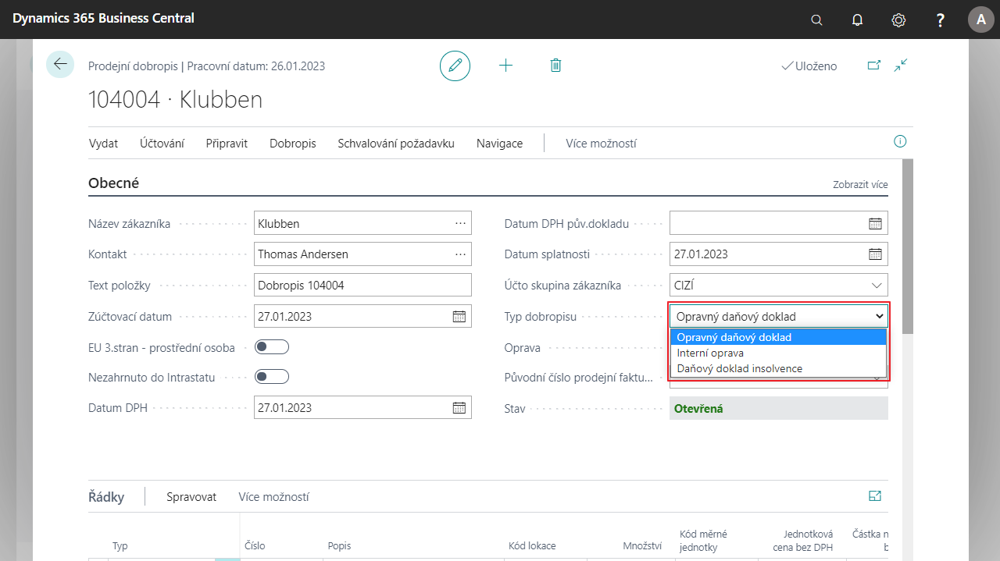

# Sales correcting documents

The functionality allows you to indicate the type of sales document in the header of the sales document and influence the print report accordingly.

According to the revision of the VAT Law, it is necessary to classify the types of sales credits. This function allows users to set the following types of credit memos:

- Tax corrective documents
- Internal correction
- Tax insolvency document

## Select type of credit memo

1. Choose the , enter  **Sales credit memo** and then select related link.
2. Click on the **New**.
3. Select customer, posting date and other required information.
4. In the document header, select one of the options in the **Credit note type** field:
    - Tax corrective documents
    - Internal correction
    - Tax insolvency document
5. Then continue processing the document as required.

## See Also

[Core Localization Pack for Czech Republic](ui-extensions-core-localization-pack-cz.md)  
[Czech Local Functionality](czech-local-functionality.md)  
[Finance](../../finance.md)  
