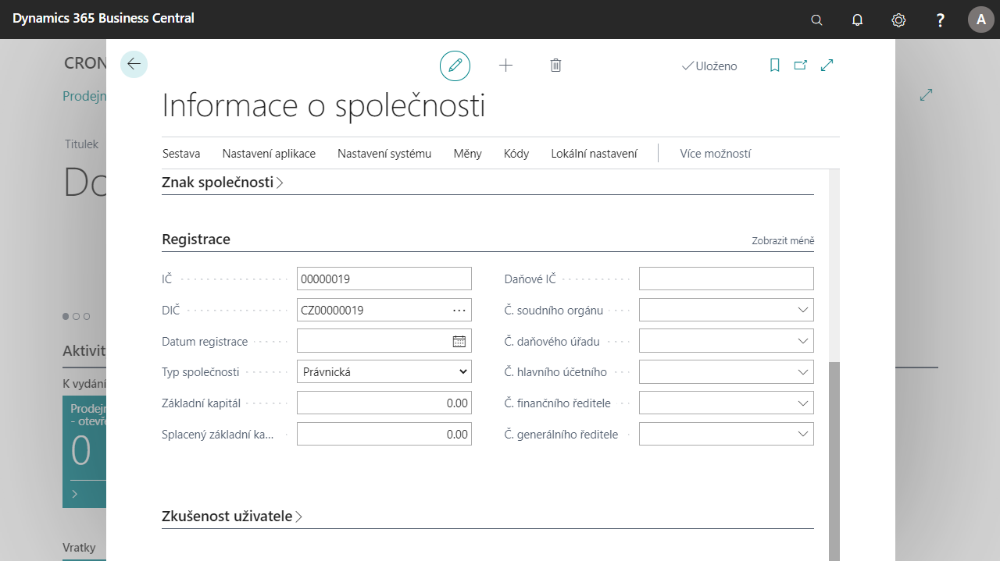

# Statutory information about the company

Currently there are many documents circulating outside and inside the company. Local legislation sets minimum requirements for such documents. These requirements can be roughly divided into three groups:

- The names of company representatives must appear on certain internal or external documents.
- Document footers – majority of external documents must contain basic information about the company in the document footers, usually in the language of the partner company.
- Company registration numbers must be prominently listed in internal and external documents.

This feature allows users to define company representatives and set them as CEO, Head Accountant and Finance Manager for use in internal and external documents.
Users can define document footers in different languages. These footers can be used in different reports and documents.

Additional company registration numbers and other registration information may be stored in the Company Information and used in documents.

## Addition of information about the company
### Setting up additional company information 
1. Choose the  icon, enter **Company Information** , and then choose the related link.
1. Na kartě Informací o společnosti v záložce **Obecné** vyplňte pole **Hlavní předmět podnikání** a **Kód výchozího bankovního účtu**.
1. Po nastavení polí stránku zavřete.
### Nastavení informací pro statutární vykazování  
1. Vyberte ikonu , zadejte **Nastavení statutárního vykazování** a poté vyberte související odkaz.
1. V Nastavení statutárního vykazování vyplňte pole **Hlavní předmět podnikání** a dále **Registrační informace**.
1. Po nastavení polí kartu zavřete.
### Založení zástupců společnosti
1. Vyberte ikonu , zadejte **Nastavení statutárního vykazování** a poté vyberte související odkaz.
1. V Nastavení statutárního vykazování v záložce **Zástupce** vyberte číselnou řadu v poli **Čísla zástupců společnosti**.
1. Po nastavení číselné řady, vyberte ikonu , zadejte **Zástupci společnosti** a poté vyberte související odkaz.
1. Na přehledu Zástupců společnosti vyberte tlačítko **Nový**.
1. Zadejte informace (Jméno, Příjmení, Funkce, Tel. číslo, Číslo zaměstnance) dle potřeby.
1. Po založení potřebných zástupců přehled zavřete.
### Založení zápatí dokumentů
1. Vyberte ikonu , zadejte **Zápatí dokumentů** a poté vyberte související odkaz.
1. V přehledu Zápatí dokumentů vytvořte nové zápatí pro každou jazykovou mutaci, kterou budete používat.
1. Na novém řádku vyplňte pole **Kód jazyka** jazyk, pro které budete zápatí definovat a dále do pole **Text zápatí** zadejte text, který se bude zobrazovat.
1. Po nastavení zápatí stránku zavřete.

 
## Viz Také

[České lokální funkcionality](czech-local-functionality.md)  
[Statutární výkazy](statutory-statements.md)
[Finance](../../finance.md)
