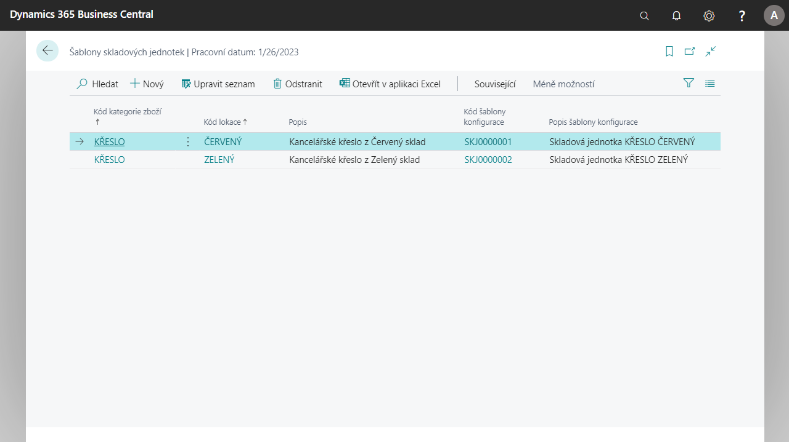

# Stock unit templates

Set up stock unit templates that can be used in the process of creating new stock units of items.

Templates are defined for a combination of Item Category and Location and  basic stock unit parameters can be set here, such as Restocking System, Order Method and more.

Stock unit templates can be used in a function that creates new stock units of items. When you create a stock unit with functions, the parameter settings in the templates are automatically copied to the stock unit tabs.

## Create and set up stock unit templates

### Create a configuration template for a stock unit template

In order to correctly set the details of the stock unit card, for example for a selected location, it is necessary to set general information such as the Ordering method, Ordering system, and others.

1. Select the icon, zadejte **Configuration templates** and then select related link.
2. In the action bar select **New**.
3. To the field **Code** edit code for stock unit.
4. To the field **Description** edit title for template.
5. In the field **ID of table** choose table 5700.
6. In rows, select the type **Field** then in the **Field Name** column, select the field from the stock unit table that you want to set. In the **Default value** field, enter what the field should contain.
Once the selected fields are set, the system will add the predefined values to the stock unit tab while using the template when creating a stock unit from the template.

### Create a stock unit template

1. Select the icon, enter **Stockkeeping unit templates** and then select related link.
2. In action bar select **New**.
3. In the new row enter field **Item Category Code** and to field **Location code** choose location. It is also possible to fill in **Configuration Template Code**, where you select the created configuration template of the stock unit and then the **Configuration Template Description** field is automatically filled in.
4. After filling in the values, you can close the template overview.
  
### Create a stock unit using a template

1. Select the icon, enter **Items** and then select related link.
2. Select the item tab for which the template is created.
3. Open Item Tab.
4. Use the **Stock** - **Stock Units** function on the item tab.
5. This will open an overview of the **Stock Units** for the item card.
6. In the overview choose function **New**.
7. On the stock unit tab, select the **Location Code** field. After selecting the field, the settings from the template are transferred to the stock unit card.
8. You can close the card after checking.

## Use of stock unit templates on selected goods

### Create a configuration template for the stock unit template for the selected items

In order to correctly set the details of the stock unit card, for example for a selected location, it is possible to set general information such as Order Method, Order System, and more.

1. Select the icon, enter **Configuration Templates** and then select related link.
2. In the action bar choose **New**.
3. To field **Code** enter code for stock unit, for example **SKJ0000003**.
4. To field **Description** fill in the name for the saber, for example "**Stock unit CHAIR BLUE**".
5. In the **Table ID** field, select the table over which the template will work. In this case, it is the table **5700** - **Stockkeeping Unit**
6. In the rows, select the **Field Type** then in the **Field Name** column, select the field from the stock unit table that you want to set. In the **Default value** field, enter what the field should contain. For example, in this application, select the **Fill System** field and the **Transfer** value.
7. Once the selected fields are set, the system will append the predefined values to the stock unit card during template use, when creating a stock unit from the template.

### Create a stock unit template for selected items

1. Select the icon, enter **Stock unit templates** and then select related link.
2. In action bar choose **New**.
3. In the new row, fill in the field **Category code** for example with the value **CHAIR**, in the field **Location code** select the location **Blue**, then the field **Description** will be filled in automatically with the text "**Office chair from Blue stock**". You can also fill in the **Configuration Template Code** by selecting **SKJ0000003** and the **Configuration Template Description** field is automatically filled in.
4. After filling in the values, you can close the template overview.
  
### Create a stock unit of the selected item using a template

1. Select the icon, enter **Item** and then select related link.
2. Use the search function to find an item **1900-S Armchair PARIS, black**
3. Open the item card.
4. Use the **Stock** - **Stock Units** function on the item tab.
5. This will open an overview of the **Stock Units** for the item card.
6. Select **New** in the overview.
7. On the stock unit tab, select the **Location Code** field. After selecting the field, the settings from the template will be transferred to the stock unit card.
8. You can close the card after checking.

## See also

[Core Localization Pack for Czech Republic](ui-extensions-core-localization-pack-cz.md)  
[Czech Local Functionality](czech-local-functionality.md)  
