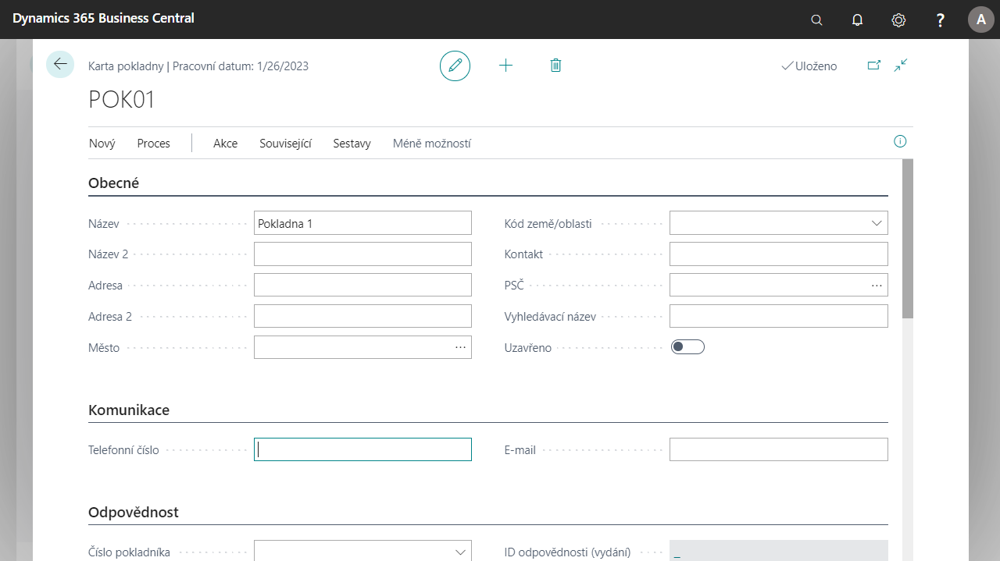
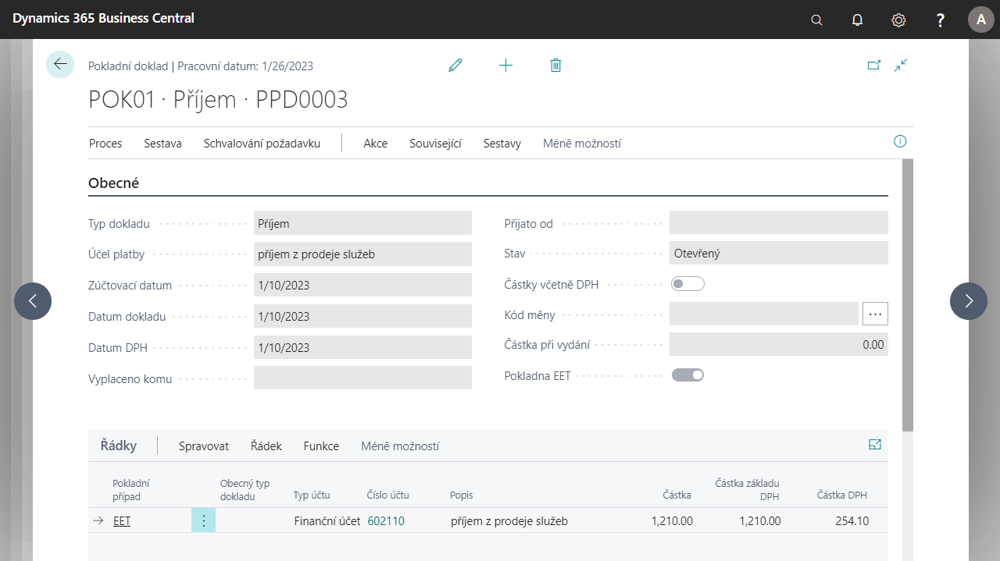
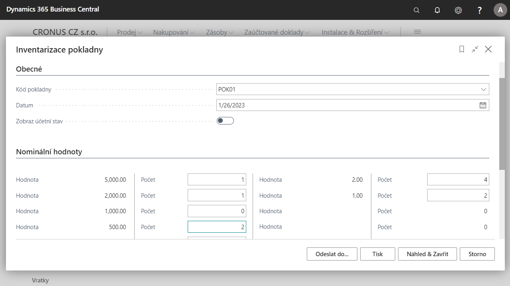

# Liquid assets (extension)

In the Czech version [!INCLUDE[d365fin](../../includes/d365fin_md.md)] helps the Cash Desk functionality to address legislative requirements and best practices in Cash Desk operations.

The cash desk and cash documents functionality allows you to define cash accounts and cash registers for physical receipt and withdrawal of money. Each cash register must have a separate cash document No. series. It is possible to set separate No. series for receipt and withdrawal documents for cash desks. Different types of cash cases can be predefined to simplify the entry of documents. It is also possible to set the user responsible for the cash desk and pass this responsibility between cash desk users.

## Key Features

- Cash desk setup, cash desk users
- Receipts and withdrawals and their posting
- Cash cases used as templates for normal posting cases
- Reconciliation of payments with customer and vendor entries
- Reconciliation of payments with advance invoices
- Cash desk inventory
- Output documents (Cash Receipt Document, Cash Withdrawal Document)
- Reports (Cash Book, Cash Desk Account Book and Cash Desk Hand Over)

The cash desk card contains basic information about the cash desk, such as number, currency, contact details, etc. It also contains settings for posting, definitions for controls and limits, and preset No. series for cash desk documents.

Cash desk documents are either receipts or withdrawals and can be in different currencies depending on the cash desk. The documents also allow issuing, posting and printing of output documents.

## Cash desk user setup

1. Choose the , enter **Cash Desk Setup** and then choose the related link.
2. On the **Cash Desk Setup** page under the **Navigation** tab, use the **Cash Desk Users** feature.
3. The Cash desk Users tab opens. To create a new user, use the **New** function.
4. In the row, select the **Cash Desk No.** that the user will be working on. Next, select the **User ID** and select whether the user will have the option to **Issue**, **Post** or **Post EET only**.
5. After setup, close the page.

## Setting up No. series for receipts and withdrawals

1. Choose the , enter **Cash Desk Setup** and then choose the related link.
2. Open the card of the selected cash desk.
3. On the **Cash Desk Setup Card**, you can find the **No. series** tab.
4. In the **Cash Receipt Order No.** and **Withdrawal Receipt No.** fields, select the No. series you want to use.
5. After setting up, close the cash desk settings card.

## Setting up Cash Desk Event

1. Choose the , enter **Cash Desk Events Setup** and then choose the related link.
2. Use the **New** function to create a event on the **Cash Desk** report..
3. Fill in the following fields as required:
    - Code, description
    - Type of cash desk document (receipt or withdrawal)
    - Account Type, Account No., Gen. Posting Type, Posting Group
    - Global Dimension Code 1 and Global Dimension Code 2 and, if applicable, whether it is an EET transaction
4. After setting up, close the list.

## Cash Inventory

For the purpose of cash desk inventory in Business Central, you can find a report for generating the balance in the cash desk.

### Nominal Value Setup

First, you need to define which banknotes and coins you use in different currencies. It is necessary to define their nominal value for each currency.

1. Choose the , enter **Currency Nominal Values** and then choose the related link.
2. Create rows in the table using the combination of **Currency Code** and **Value**. Do not select a currency code to set the local currency of the system.
3. After defining the rows, you can close the page.

### Cash Inventory Report

1. Choose the , enter **Cash Inventory** and then choose the related link.
2. On the page before running the report, select input parameters such as:
    - **Cash Desk Code** for which the inventory is being taken.
    - **Date** when the inventory is carried out.
    - Option **Show Statistics** of the cash register in the report.
    - Next on the page, fill in the table **Nominal values**, i.e. the number of individual banknotes and coins.
3. After setting the filters, use the **Preview and Close** button. You will then see a page where you can see the status of the selected cash desk.

## Reconciliation of customer or vendor entries

The Reconcile Entries function can be run from the cash document lines to select customer or supplier entries to be reconciled. Similarly, functions are available for balancing with advance invoices.

1. Choose the , enter **Cash Document** adn then choose the related link.
2. In the **Cash Document overview**, create a cash document using the **New** button.
3. Fill in the fields on the cash receipt card:
    - Document type: Receipt or Withdrawal
    - Payment Purpose: list the text that specifies the purpose of the payment
    - Posting date, Document date and VAT
    - Possibly other fields as required
4. In the lines select:
    - Account Type: Customer or Vendor
    - Account number: Select Customer or Vendor number
    - In the functions above the line, use the **Apply Entries** function to find the entry you want to apply.
5. After selecting the entry, you can post the document.

## See Also

[Czech Local Functionality](czech-local-functionality.md)  
[Finance](../../finance.md)
