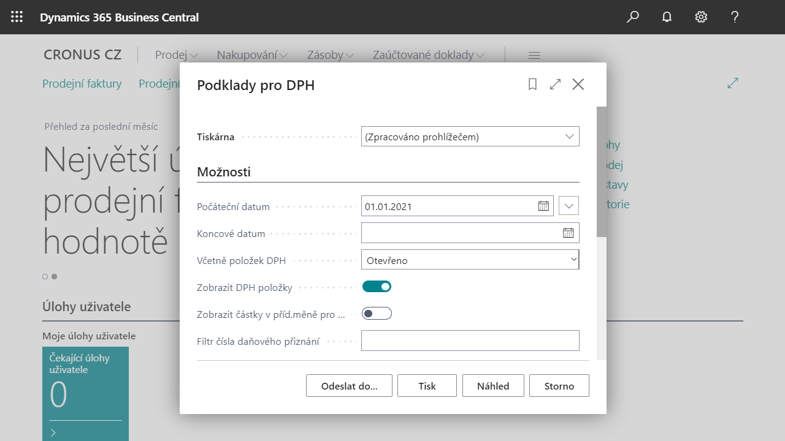

# VAT reports

The following reports are available to meet the requirements for VAT print output to comply with legislative requirements and local practices:

- Výpočet a účtování vyrovnání DPH - přizpůsobení standartní sestavy
- Podklady pro DPH
- Seznam daňových dokladů
- Přehled DPH na prodejních zálohách
- Přehled DPH na nákupních zálohách

### VAT basis

Report, which prints an overview of all posted documents for the selected period sorted by individual VAT posting group combination. You can print report with overview of individual documents (VAT entries) or summed up in amounts for each combination. The report is used as a basis for checking the posting.

### List of tax documents

Report, that can be used to clearly print the VAT base and amount for individual tax documents for a specific period. The report can be printed either summarized by tax type and tax rate or broken down into individual documents by purchase only, sale only or both. 

### Financial reconciliation of VAT

Report, which prints the split of individual lines of the VAT statement according to financial accounts.

## Starting the VAT Statements report

Preview of items charged for the period.

1. Choose the , enter  **VAT Statements** and then select related link.
2. On the **Options** tab, enter the value of the first date for the period of the posted document for VAT items in the **Start Date** field.
3. In the **Including VAT items** field, select **Open**.
4. Choose option **Show VAT items**.
5. Run the report using the **Preview** button.
6. The following report shows the purchase invoices charged in the given period, according to the settings.
7. In the VAT Basis print report, items are filtered by VAT date and contain information such as country code, partner's VAT number, VAT base and VAT amount.

## See also

[Core Localization Pack for Czech Republic](ui-extensions-core-localization-pack-cz.md)  
[Czech local functionality](czech-local-functionality.md)  
[VAT control report](how-to-create-vat-control-report.md)  
[VAT date](how-to-setup-vat-date.md)  
[VAT report](vat-statement.md)  
[Finance](../../finance.md)  
