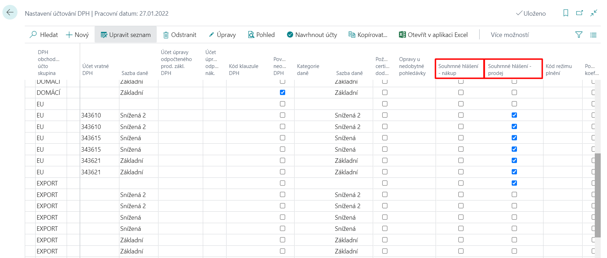
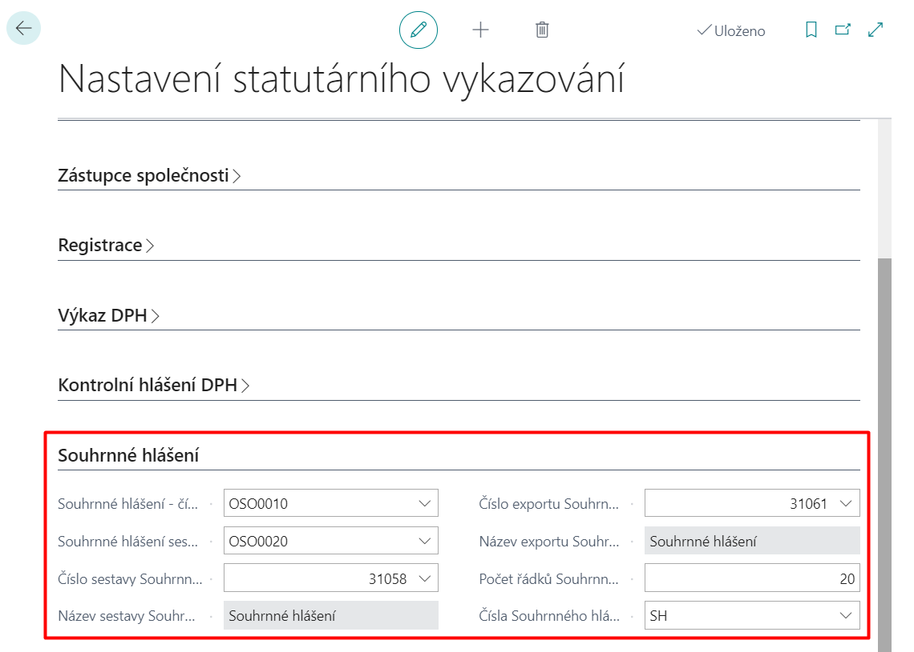

# Vies

The VIES is used to report sales to tax authorities in EU (European Union) countries. According to § 102 of the VAT Act 235/2004, the taxpayer is obliged to submit the VIES. The VIES must be submitted electronically to the tax office.  

The functionality of the VIES allows:

- Set Stat. Reporting with General Reporting Setup.
- Select combinations of VAT Business Posting Group and VAT Inventory Posting Group (VAT Posting Setup) for inclusion in the VIES.
- Keep a history of VIES.
- Enter all information required for electronic file submission.
- Suggest lines for VIES.
- Support corrective reporting.
- Export data to an electronic submission file.

## Setup

The following pages have been modified for this functionality:

### VAT Posting Setup

1. Choose the "), enter **VAT Posting Setup**.
2. Fields **VIES - Purchase** and **VIES - Sales** have been added to this summary table.
3. These fields need to be set (ticked), to set the posting you want to include in the sales/purchase summary report.
4. After the settings are correct, you can close the page.

> [!NOTE]
> These fields are also added on the **VAT Posting Setup Card** page. You can therefore tick these fields on the **VAT Posting Setup** page or on the **VAT Posting Setup Card** page (if you tick these fields on one page, they will automatically be ticked on the other).  
> To navigate to the **VAT Posting Setup Card** page, on the **VAT Posting Setup** page, click on the row for which you want to view this page and click **Edit**.

### Statutory Reporting Setup

1. Choose the "), enter **Statutory Reporting Setup**.
2. In this setup table, the **VIES** tab has been added where the appropriate fields need to be set:
    - **VIES - Authorized Employee No.** - Identifies the authorized employee for the VIES.
    - **VIES compiled by - Employee No.** - Identifies the employee who compiled the VIES.
    - **VIES No.** - Specifies the object number for the VIES.
    - **VIES Name** - Specifies the name of the object for the VIES.
    - **VIES Export Number** - Specifies the object number for the VIES export.
    - **VIES Export Name** - Specifies the name of the object to export the VIES.
    - **Number of VIES Lines** - Specifies the number of VIES lines.
    - **VIES Numbers** - Specifies the No. series for the VIES.

3. After the settings are correct, you can close the page.

## Use

If you set up all the necessary points from the VIES settings correctly (you create and post, for example, a sales invoice for items or services delivered to the EU), these values will be included in the report when you create the VIES.

1. Choose the "), enter **VIES**.
2. To create a new VIES, click **NEW** on the **VIES** page.
3. On the **VIES** page, fill in the header fields as required.
4. If you want to use the system to design lines for the specified period of the VIES, click on the batch job **Process -> Suggest lines...**
5. To get the lines for the correction VIES, click on the batch job **Process -> Get lines for correction...**
6. If the VIES lines are entered correctly, you must issue the document. When the document is issued, the report can be printed or exported. This can be done using the **Process -> Issue** function.
7. To export the VIES, click **Process -> Export**. This batch job exports the VIES results to XML format.

> [!NOTE]
> The **Reports -> Test Report** function displays a test report of the VIES so you can find and correct errors before issuing or exporting the document.

## See Also

[Core Localization Pack for Czech Republic](ui-extensions-core-localization-pack-cz.md)  
[Czech Local Functionality](czech-local-functionality.md)  
[Finance](../../finance.md)  
